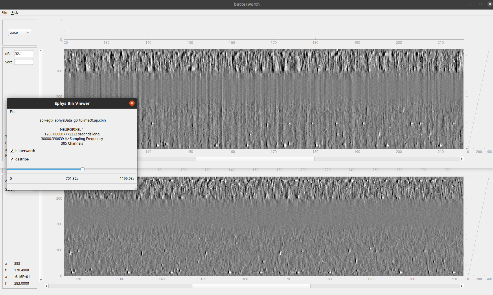

# ibl-neuropixel
Collection of tools to handle Neuropixel 1.0 and 2.0 data
(documentation coming soon...)

## Installation
`pip install ibl-neuropixel`


## Destriping
### Getting started
This relies on a fast fourier transform external library: `pip install pyfftw`.

Minimal working example to destripe a neuropixel binary file. 
```python
from pathlib import Path
from ibldsp.voltage import decompress_destripe_cbin
sr_file = Path('/datadisk/Data/spike_sorting/pykilosort_tests/imec_385_100s.ap.bin')
out_file = Path('/datadisk/scratch/imec_385_100s.ap.bin')

decompress_destripe_cbin(sr_file=sr_file, output_file=out_file, nprocesses=8)
```

### Viewer

The best way to look at the results is to use [viewephys](https://github.com/oliche/viewephys),
open an ephys viewer on the raw data.

- tick the destripe box.
- move to a desired location in the file
- ctr+P will make the gain and axis the same on both windows



You can then move within the raw data file.

### White Paper
The following describes the methods implemented in this repository.
https://doi.org/10.6084/m9.figshare.19705522

## Contribution

Pypi Release checklist:
- Edit the version number in `setup.py`, and add release notes in `release_notes.md`

```shell
flake8
tag=X.Y.Z
git tag -a $tag 
git push origin %tag
```

Create new release with tag X.Y.Z (will automatically publish to PyPI)
